<div align="center">
  <h1>
    
    EasyAccounts
  </h1>
  <p><strong>开源中文记账软件 · 数据自主可控 · AI 智能助手</strong></p>
  <p>
    <a href="https://github.com/QingHeYang/EasyAccounts/stargazers"></a>
    <a href="https://github.com/QingHeYang/EasyAccounts/network/members"></a>
    <a href="https://github.com/QingHeYang/EasyAccounts/blob/main/LICENSE"></a>
    <a href="https://hub.docker.com/r/775495797/easyaccounts-server"></a>
    
  </p>
  <p>
    <a href="https://mercys-organization-2.gitbook.io/easyaccounts/">📚 文档</a> •
    <a href="./docs/deploy.md">🐳 部署</a> •
    <a href="./docs/feature-showcase.md">📸 截图</a> •
    <a href="./docs/changelog.md">📝 历史版本</a>
  </p>
</div>

---

## 简介

EasyAccounts 是一款**开源中文记账软件**，支持本地 Docker 部署，数据完全自主可控。

新版本集成 **AI 智能助手**，可以通过对话查询、新增、修改流水，还能生成你想要的 Excel 报表。

如果你对互联网上的记账 App 不放心，担心**信息泄露**或**数据丢失**，也许这个项目能满足你的需求。

## 快速了解

| 项目 | 说明 |
|------|------|
| 👤 面向受众 | 个人 / 家庭 (不支持团队) |
| 🐳 部署要求 | 会使用 Docker Compose |
| 💻 支持平台 | Linux · Windows · macOS · 飞牛Fnos |
| 📦 资源消耗 | 内存 500-800MB |

## 核心特点

| 功能 | 说明 |
|------|------|
| 📝 记账管理 | 账户 · 收支操作 · 二级分类 · 明细流水 |
| 🔍 数据筛选 | 时间 · 账户 · 分类 · 备注 |
| 📊 报表生成 | 月度账单 · 筛选报表 · Excel 导出 |
| 🤖 AI 助手 | 对话记账 · 智能查询 · 图片识别 · MCP (SSE / Streamable-HTTP) |
| 📧 消息推送 | SQL 备份 · Excel 邮件推送 |
| 🔐 安全特性 | 登录认证 · 单点登录 · 数据自主可控 |

## 项目部署

```bash
git clone https://github.com/QingHeYang/EasyAccounts.git
cd EasyAccounts
docker compose up -d
```

启动后访问 `http://你的IP:10669`

详细部署说明：[部署文档](./docs/deploy.md) | [GitBook](https://mercys-organization-2.gitbook.io/easyaccounts/)

## 版本动态

### 最新版本 v2.6.0

**重要特性**
- 新增 PC 端，重构移动端，界面完全重新设计，更符合现代审美
- 支持日间/夜间模式切换
- AI 增加 MCP 功能（SSE / Streamable-HTTP），可使用第三方 AI 工具
- AI 增加图像识别功能（需 VL 大模型支持，普通模型上传图片会导致当前对话作废）

**新增功能**
- 认证模式优化：固定时间退出 → 滑动时间退出，支持多端登录（可在 compose 中配置）
- AI 工具显示优化，不再显示参数，新增可点击交互工具
- AI 记账/更新会在备注中默认增加 `#AI记账` `#AI更新` 标签，方便溯源
- 总览月度概览标注收入、支出、结余、负收入
- 桌面端总览增加年度收支趋势
- 双端总览增加隐私按钮
- 快记模板备注会默认增加模板名称
- 统计页面图表重构，可快速排除某分类，无需去设置里操作
- 统计-分类统计增加最高最低标注、折线面积图
- 设置页面增加 AI+ 设置（MCP 地址、Token 统计、对话工具数目）
- 设置页面增加系统信息（深浅肤色、认证信息、备份信息、各组件版本号）
- Excel 模板优化：xls → xlsx，收入绿色、支出红色，更直观

**Bug 修复**
- 修复不计入总金额记账出现 500 问题
- 修复 AI 选择一级分类记账导致统计分类找不到明细的问题

**技术特性**
- 前端 JS → TS，vue-cli → Vite，引入 ECharts、Element Plus、Vant
- 后端 Spring 2.x → 3.x，Java 11 → 17
- Agent 框架（koalaq_hub）优化，引入 FastMCP
- 部署简化：无需复制初始化数据库文件（已内置到 MySQL 镜像）

### 下一版计划

> 我思路比较跳脱，很多情况下不会按照计划来

- 账单导入
- 定时记账
- 可能会拓展数据库

查看完整版本历史：[更新日志](./docs/changelog.md) | [GitBook](https://mercys-organization-2.gitbook.io/easyaccounts/release-notes)  
  

## 功能预览

<table>
  <tr>
    <td align="center">
      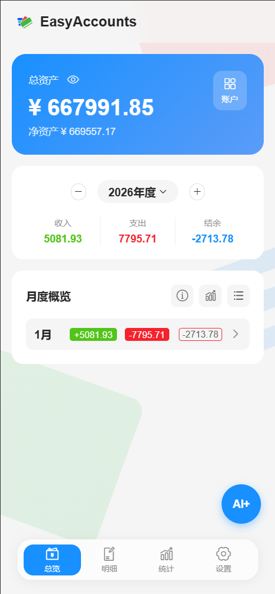
      <br><b>总览</b>
    </td>
    <td align="center">
      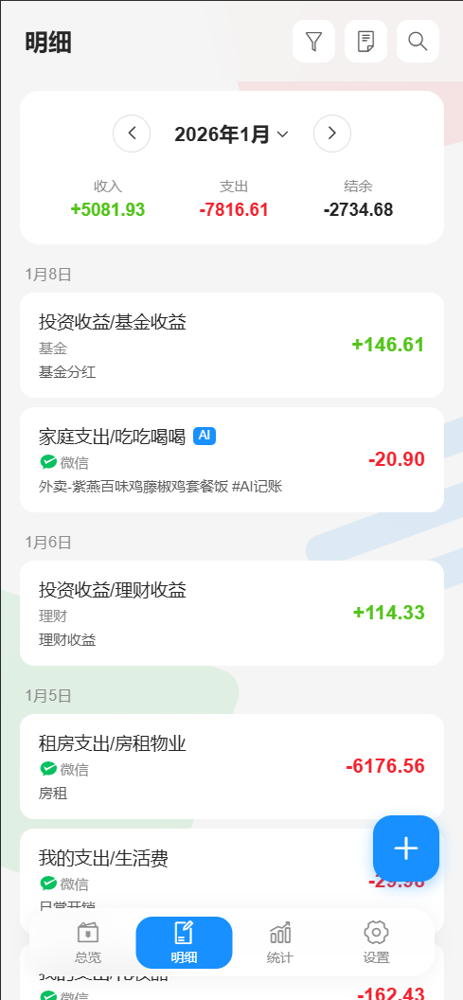
      <br><b>明细</b>
    </td>
    <td align="center">
      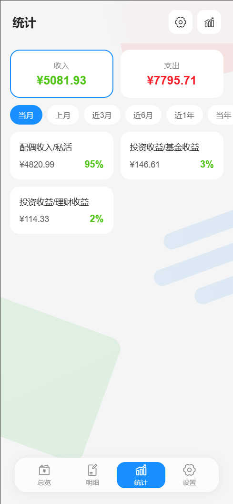
      <br><b>统计</b>
    </td>
    <td align="center">
      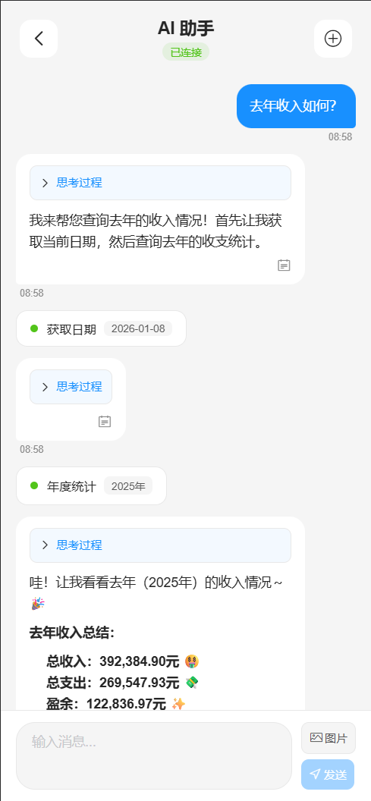
      <br><b>AI 对话</b>
    </td>
  </tr>
</table>

<table>
  <tr>
    <td align="center">
      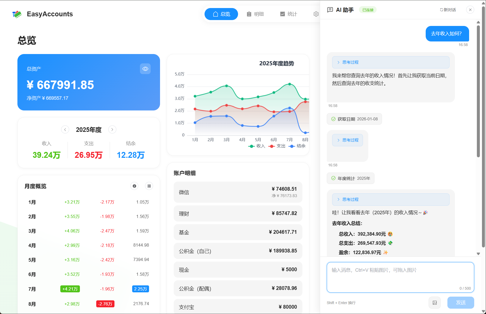
      <br><b>AI 对话</b>
    </td>
    <td align="center">
      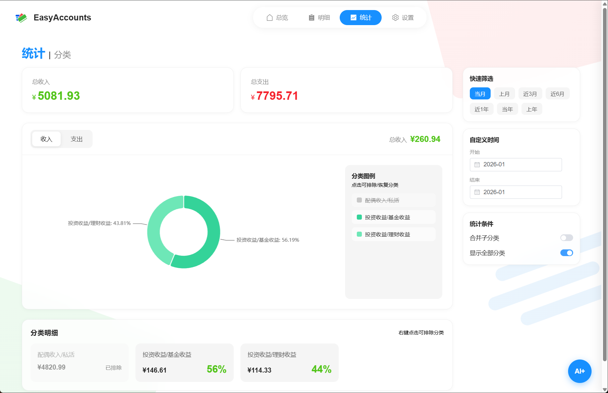
      <br><b>统计分析</b>
    </td>
    <td align="center">
      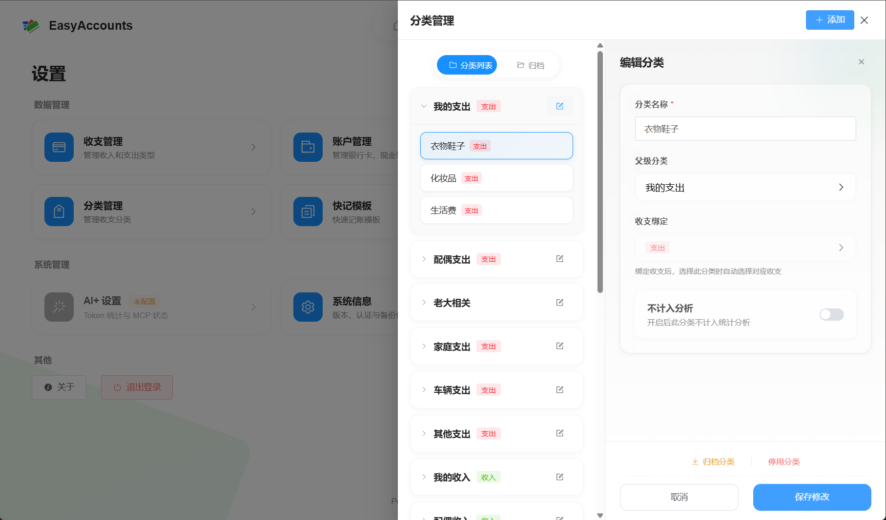
      <br><b>分类设置</b>
    </td>
  </tr>
</table>

查看更多截图：[功能展示](./docs/feature-showcase.md)

## 功能说明

### 记账基础

记账围绕四个维度：**账户**、**收支操作**、**分类**、**明细**

- **账户**：你的钱放在哪，比如现金、银行卡、支付宝
- **收支操作**：钱怎么动的，收入、支出、借入、借出、内部转账（默认已配好，够用）
- **分类**：钱花在哪，支持二级分类，比如「用车」下面可以有「加油」「保险」
- **明细**：每一笔流水记录

记一笔账：选账户 → 选操作 → 选分类 → 填金额 → 保存，搞定。

### AI 助手

接入大模型 API，支持：
- 对话记账：「昨天午饭花了 25」
- 智能查询：「这个月花了多少」
- 图片识别：拍个小票自动识别
- MCP 功能：支持 SSE / Streamable-HTTP 协议

需要自己配置 API Key，支持多家大模型。

### 报表导出

两种 Excel 报表：
- **月度账单**：在明细页面生成当月账单
- **筛选账单**：按条件筛选后导出

> 小提示：生成历史月份账单时，账户余额会追溯到当时的金额

### 数据备份

- **SQL 自动备份**：在 docker-compose.yml 配置 cron 规则，备份文件在 `Resource/sql/`
- **邮件推送**：配置 WebHook 后，SQL 备份和 Excel 都能发到邮箱

<table>
  <tr>
    <td align="center">
      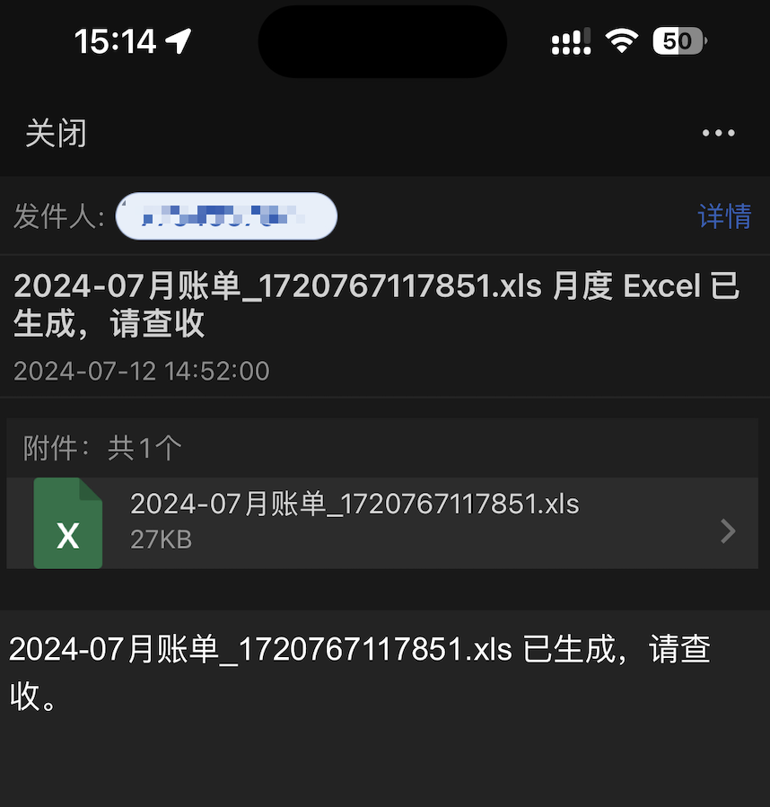
      <br><b>邮件推送</b>
    </td>
    <td align="center">
      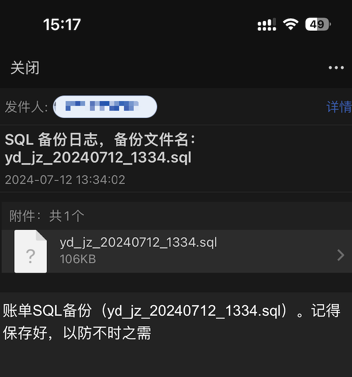
      <br><b>SQL 备份邮件</b>
    </td>
  </tr>
</table>

详见：[WebHook 配置说明](https://mercys-organization-2.gitbook.io/easyaccounts/deploy/webhook)

### 开发者友好

- Swagger 接口文档：方便二次开发
- Nginx 文件服务：直接下载生成的文件

<table>
  <tr>
    <td align="center">
      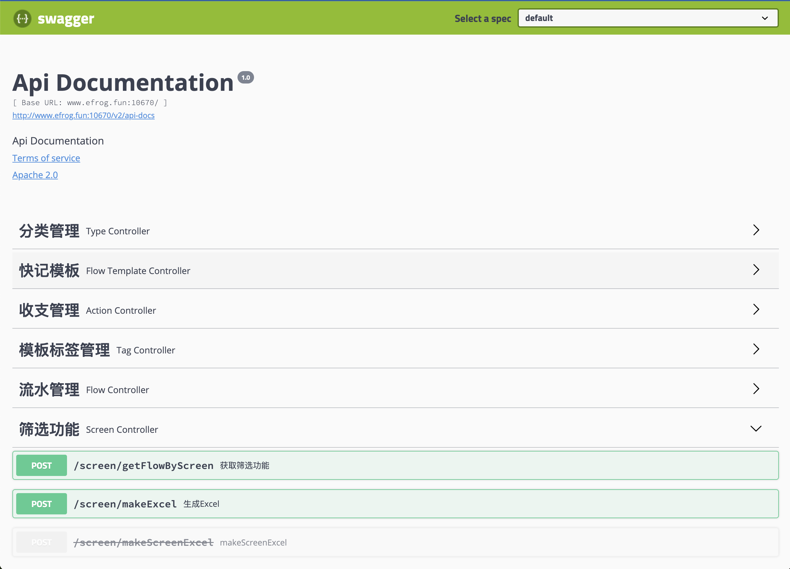
      <br><b>Swagger 接口文档</b>
    </td>
    <td align="center">
      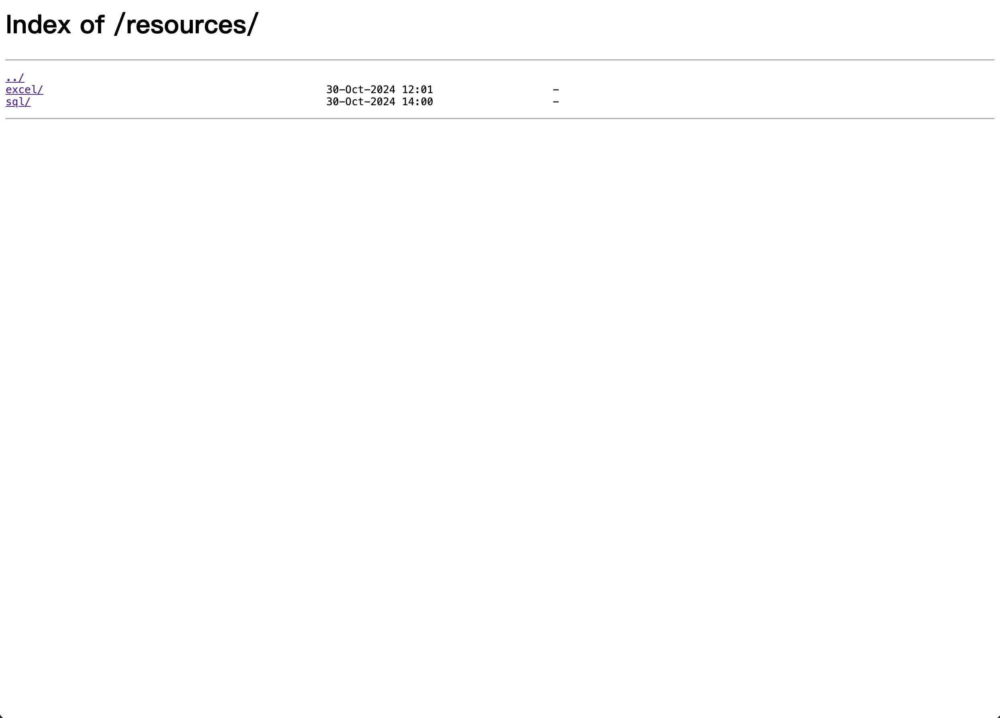
      <br><b>Nginx 文件下载</b>
    </td>
  </tr>
</table>

详见：[项目访问地址](https://mercys-organization-2.gitbook.io/easyaccounts/deploy/deploy#xiang-mu-fang-wen)

---

## 写在最后

这个项目从 2021 年 9 月开始，到现在已经 3 年多了。

我是个旧时代的 Android 工程师，从 2024 年开始大量用 AI 辅助开发（ChatGPT、Copilot、Cursor、Claude...），所以代码注释可能有点糙，请多包涵。

**重要提醒**：一定要保护好 SQL 备份数据，bug 可以修，项目可以重部署，但数据丢了就真没办法了。

这个项目会一直维护下去，因为我自己天天在用。有好点子随时告诉我，合适的话我会加上。

欢迎 Star，遇到问题欢迎提 Issue。项目永久免费开源。

另外我是个社恐，加微信、拉群这种事可能会有点迟疑，不是不想理你，是真的社恐，请多包涵。

**关于贡献**：目前新版本还在调试中，源码仓库暂时落后于发布版本，想参与贡献的朋友请耐心等待。

### 支持项目

如果你愿意支持 EasyAccounts，扫码捐赠的款项我会以 **EasyAccounts** 项目名义转赠至**腾讯公益孤儿救助项目**。

<table>
  <tr>
    <td align="center"></td>
    <td align="center"></td>
  </tr>
</table>

---

[](https://star-history.com/#QingHeYang/EasyAccounts&Date)